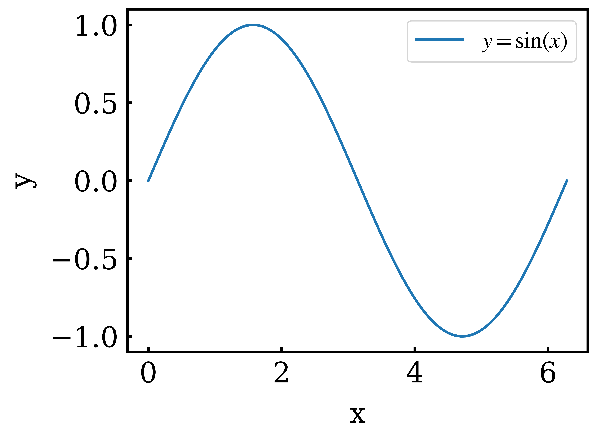
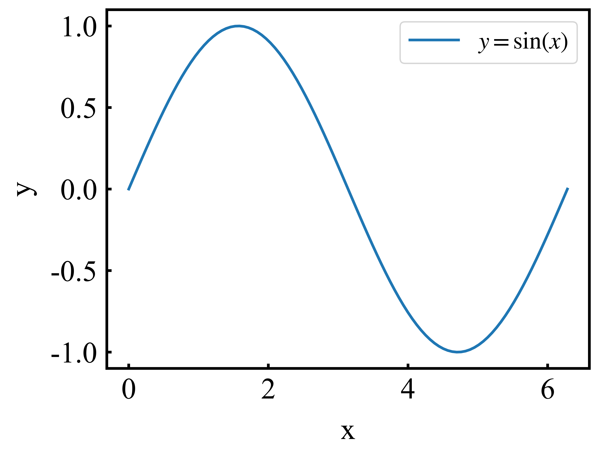
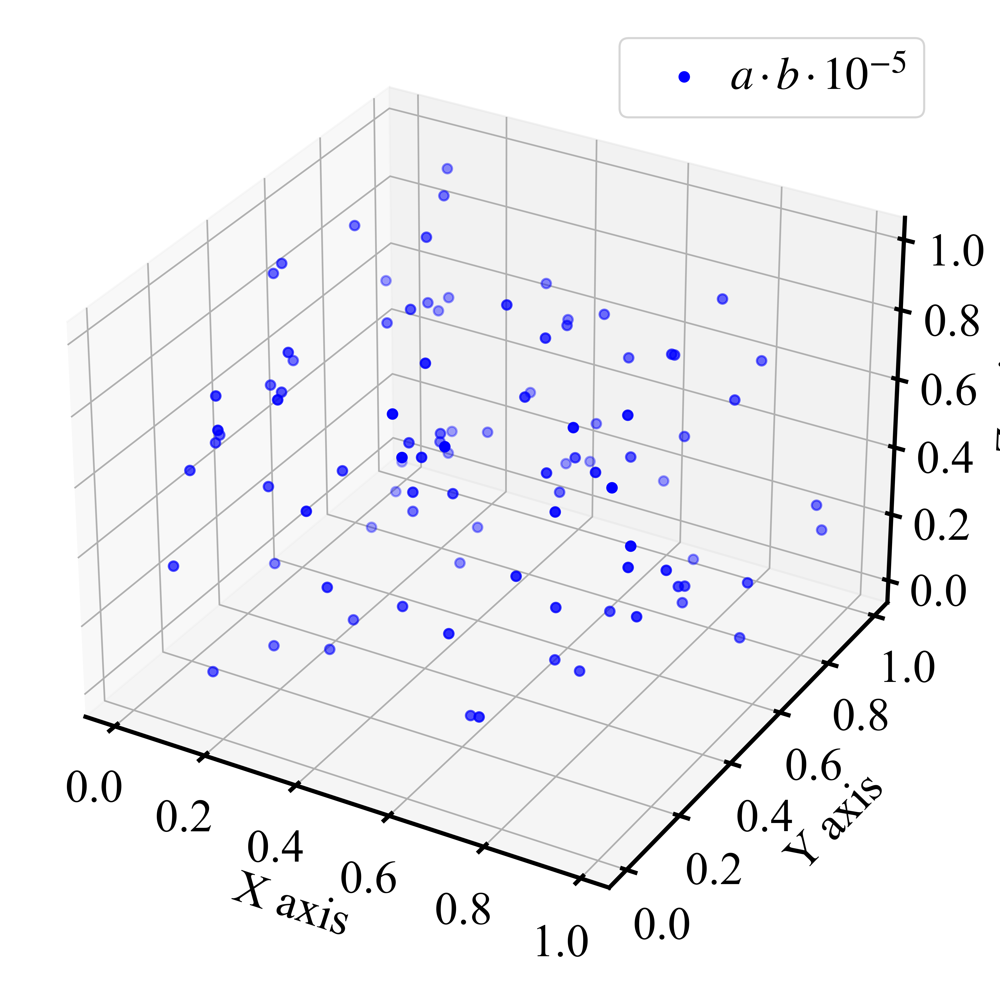
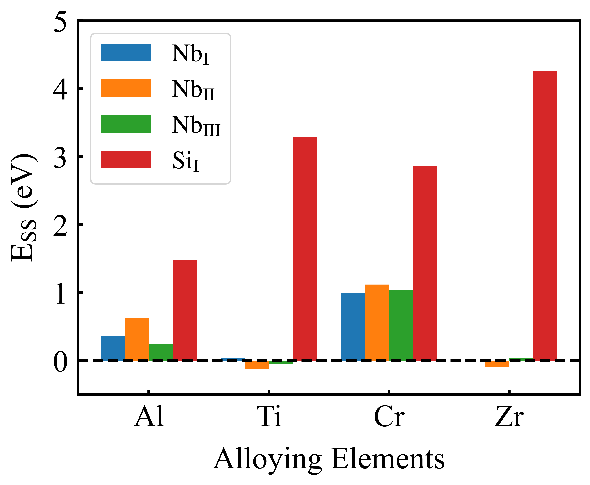

# spt

scientific matplotlib plot template python module.

---

## Installation

```bash
git clone https://gitee.com/yangsl306/spt.git
cd spt

# install
python setup.py install
```

---

## To do

- [ ] 3D 图绘制三个轴标签显示不全
- [ ] 完善 `setup.py` 安装脚本

---

## Usage

### use set_plot_params function

[plot.py](./plot.py)

- plot:

```python
from plot_params import set_plot_params

...

set_plot_params()

fig, ax = plt.subplots()

...

```

---

- Figure:



---

### use set_roman_plot_params function

[plot_roman.py](./plot_roman.py)

- requirements:

To use times new roman font, you need to do:

```bash
# cp roman-ttf fonts to your matplotlib font path in your conda env
cp roman-ttf/* <<conda_env>>/lib/pythonXXX/site-packages/matplotlib/mpl-data/fonts/ttf/

# remove matplotlib cache
rm -rf ~/.cache/matplotlib
```

---

- plot:

```python
from plot_params import set_roman_plot_params

...

set_roman_plot_params()

fig, ax = plt.subplots()

...

```

---

- Figure:



---

- 3d plot:

[plot_3d.py](./plot_3d.py)

```python
from mpl_toolkits.mplot3d import Axes3D
from plot_params import set_roman_plot_params

...

set_roman_plot_params(
    axes_labelpad=15,
    legend_fontsize=22,
    legend_handletextpad=0.0,
)

fig, ax = plt.subplots(subplot_kw={"projection": "3d"}, figsize=(15, 8))

...

```

---

- Figure:



---

### Chinese characters plot

[plot_zh.py](./plot_zh.py)

- requirements:

To use chinese(SimHei 黑体) font, you need to do:

```bash
# cp SimHei-ttf fonts to your matplotlib font path in your conda env
cp chinese-config/chinese-ttf/* <<conda_env>>/lib/pythonXXX/site-packages/matplotlib/mpl-data/fonts/ttf/

# you need to backup matplotlibrc file first
cp chinese-config/matplotlibrc <<conda_env>>/lib/pythonXXX/site-packages/matplotlib/mpl-data/

# remove matplotlib cache
rm -rf ~/.cache/matplotlib
```

`matplotlibrc` modification:

```bash
# origin 
#font.family:  sans-serif

#font.sans-serif: DejaVu Sans, Bitstream Vera Sans, Computer Modern Sans Serif, Lucida Grande, Verdana, Geneva, Lucid, Arial, Helvetica, Avant Garde, sans-serif

#axes.unicode_minus: True  # use Unicode for the minus symbol rather than hyphen.  See

---

# modification
font.family:  sans-serif

font.sans-serif: DejaVu Sans, Bitstream Vera Sans, Computer Modern Sans Serif, Lucida Grande, Verdana, Geneva, Lucid, Arial, Helvetica, Avant Garde, sans-serif, SimHei, Times New Roman, Times

axes.unicode_minus: False  # use Unicode for the minus symbol rather than hyphen.  See
```

---

- plot test script:

```python
from plot_params import set_roman_plot_params

...

set_roman_plot_params()

fig, ax = plt.subplots()

ax.plot(x, y, label="正弦函数")

# x y轴标签 字体设置为SimHei
# ax.set_xlabel("x 轴", fontproperties="SimHei")
# ax.set_ylabel("y 轴", fontproperties="SimHei")

# legend 设置simhei字体
ax.legend(prop={"family": "SimHei"})

...

```

---

- Figure


---

## Scientific figure examples

- Figure 1:



---

- Figure 2:


