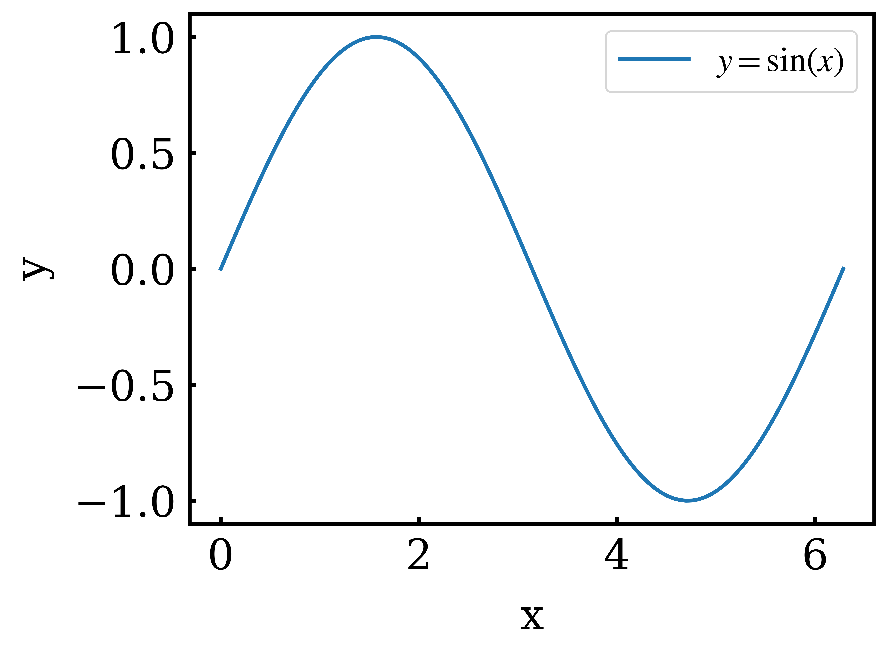
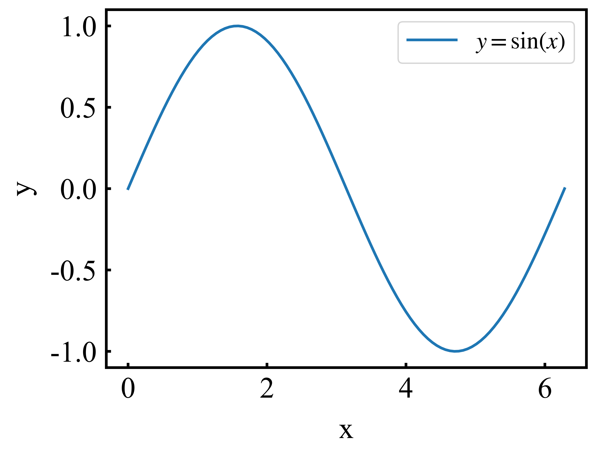
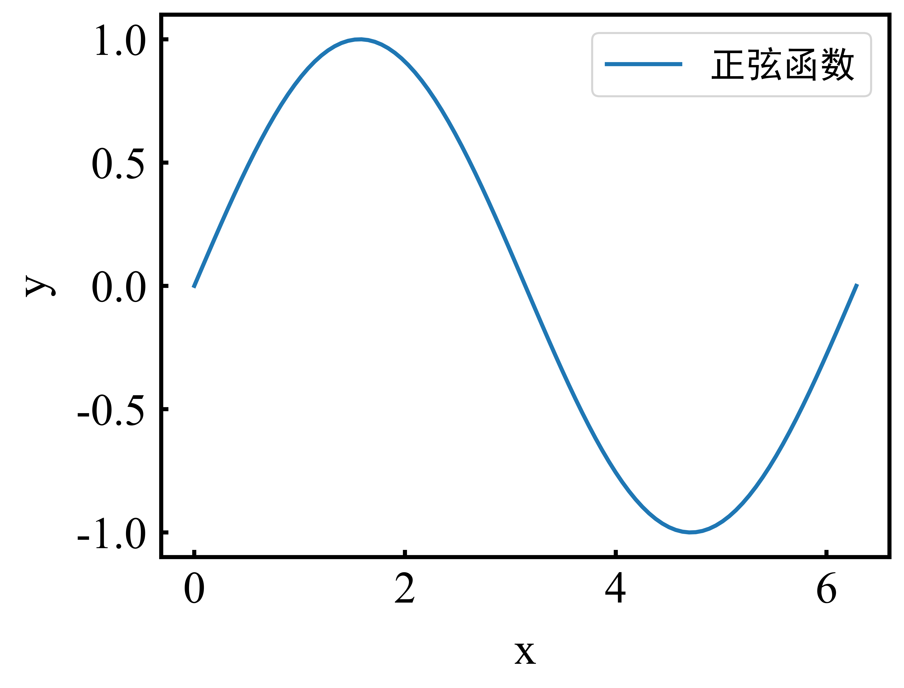
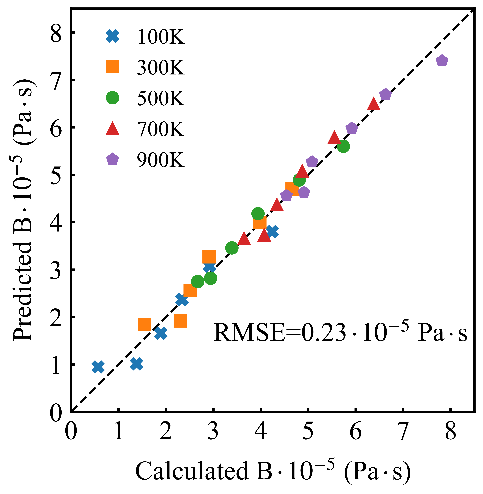

# spt

Scientific matplotlib plot template python module.

---

## Installation

Note: Please install matplotlib package first.

```bash
git clone https://gitee.com/yangsl306/spt.git
cd spt

pip install .
```

---

## To do

- [ ] 3D 图绘制三个轴标签显示不全
- [x] 完善 `setup.py` 安装脚本
- [x] 安装 spt package 后，使用 `fig, ax = plt.subplots()` 命令，VSCode 的 Pylance 插件无法自动识别 `ax` 对象的属性和方法（matplotlib 3.8 版本的问题，需将 matplotlib 版本降到 3.8 以下）

---

## Usage

### use set_plot_params function

[plot.py](./examples/plot.py)

- plot:

```python
from spt.plot_params import set_plot_params

...

set_plot_params()

fig, ax = plt.subplots()

...

```

---

- Figure:



---

### use set_roman_plot_params function

[plot_roman.py](./examples/plot_roman.py)

- requirements:

To use times new roman font, you need to do:

```bash
# cp roman-ttf fonts to your matplotlib font path in your conda env
cp roman-ttf/* <<conda_env>>/lib/pythonXXX/site-packages/matplotlib/mpl-data/fonts/ttf/

# remove matplotlib cache
rm -rf ~/.cache/matplotlib
```

---

- plot:

```python
from spt.plot_params import set_roman_plot_params

...

set_roman_plot_params()

fig, ax = plt.subplots()

...

```

---

- Figure:



---

- 3d plot:

[plot_3d.py](./examples/plot_3d.py)

```python
from mpl_toolkits.mplot3d import Axes3D
from spt.plot_params import set_roman_plot_params

...

set_roman_plot_params(
    axes_labelpad=15,
    legend_fontsize=22,
    legend_handletextpad=0.0,
)

fig, ax = plt.subplots(subplot_kw={"projection": "3d"}, figsize=(15, 8))

...

```

---

- Figure:


---

### Chinese characters plot

[plot_zh.py](./examples/plot_zh.py)

- requirements:

To use chinese(SimHei 黑体) font, you need to do:

```bash
# cp SimHei-ttf fonts to your matplotlib font path in your conda env
cp chinese-config/chinese-ttf/* <<conda_env>>/lib/pythonXXX/site-packages/matplotlib/mpl-data/fonts/ttf/

# you need to backup matplotlibrc file first
cp chinese-config/matplotlibrc <<conda_env>>/lib/pythonXXX/site-packages/matplotlib/mpl-data/

# remove matplotlib cache
rm -rf ~/.cache/matplotlib
```

`matplotlibrc` modification:

```bash
# origin 
#font.family:  sans-serif

#font.sans-serif: DejaVu Sans, Bitstream Vera Sans, Computer Modern Sans Serif, Lucida Grande, Verdana, Geneva, Lucid, Arial, Helvetica, Avant Garde, sans-serif

#axes.unicode_minus: True  # use Unicode for the minus symbol rather than hyphen.  See

---

# modification
font.family:  sans-serif

font.sans-serif: DejaVu Sans, Bitstream Vera Sans, Computer Modern Sans Serif, Lucida Grande, Verdana, Geneva, Lucid, Arial, Helvetica, Avant Garde, sans-serif, SimHei, Times New Roman, Times

axes.unicode_minus: False  # use Unicode for the minus symbol rather than hyphen.  See
```

---

- plot test script:

```python
from spt.plot_params import set_roman_plot_params

...

set_roman_plot_params()

fig, ax = plt.subplots()

ax.plot(x, y, label="正弦函数")

# x y 轴标签 字体设置为 SimHei
# ax.set_xlabel("x 轴", fontproperties="SimHei")
# ax.set_ylabel("y 轴", fontproperties="SimHei")

# legend 字体设置为 SimHei
ax.legend(prop={"family": "SimHei"})

...

```

---

- Figure



---

## Scientific figure examples

- Figure 1:


---

- Figure 2:


