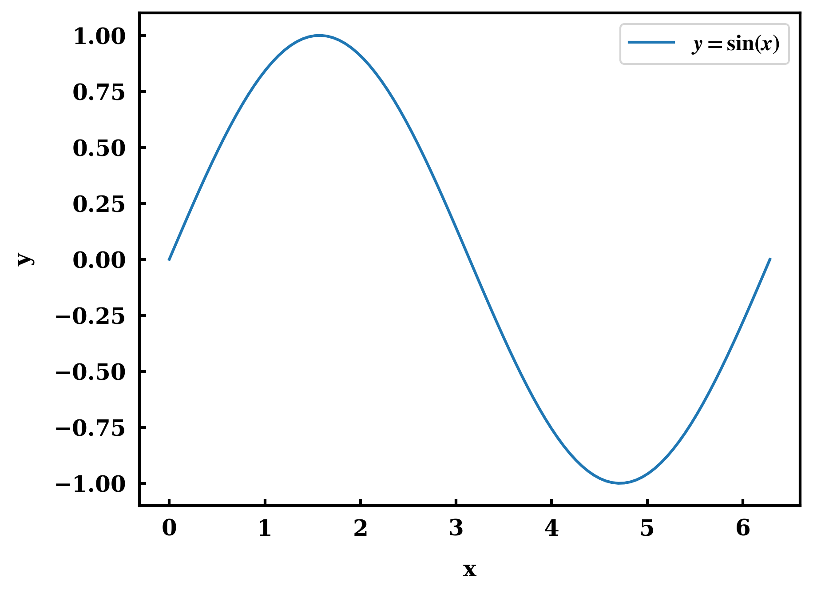
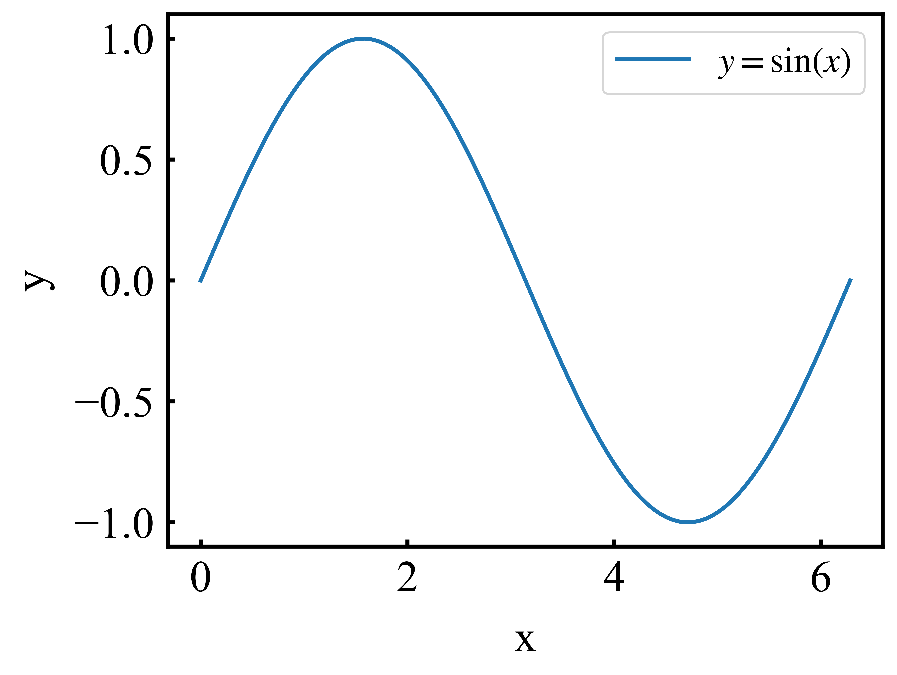
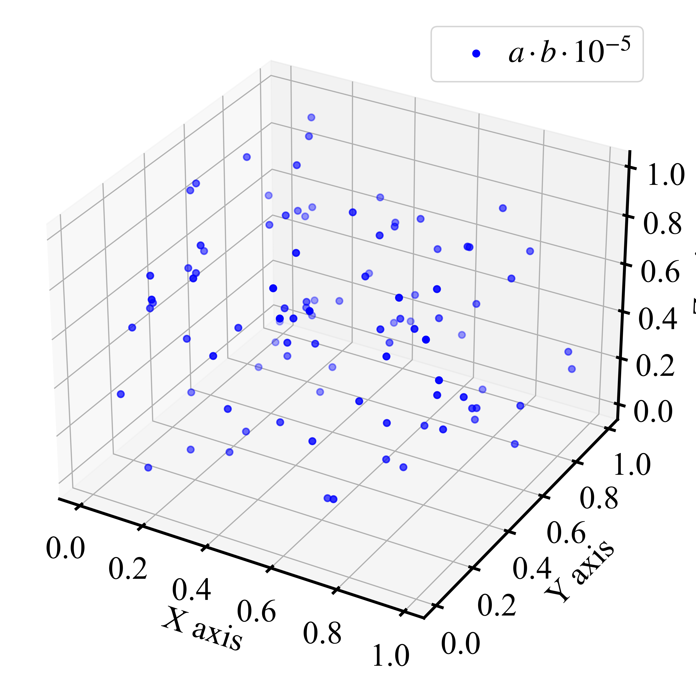

# spt

scientific matplotlib plot template python module(`plot_params.py` and `plot_params_roman.py`).


**Note: the module can't render chinese characters!!!**


---
---


## Usage

### use plot_params.py

- plot test script:
  
```python
import numpy as np
import matplotlib.pyplot as plt
from plot_params import set_plot_params


x = np.linspace(0, 2*np.pi, 100)
y = np.sin(x)

set_plot_params()

fig, ax = plt.subplots()

ax.plot(x, y, label='$y=\sin(x)$')

ax.set_xlabel('x')
ax.set_ylabel('y')
ax.legend()

fig.savefig('sin.png')

print("figure is generated!")
```

---

- Figure:




---


### use plot_params_roman.py

- requirements:

To use times new roman font, you need to do:

```bash
# cp roman-ttf fonts to your matplotlib font path in your conda env
cp roman-ttf/* <<conda_env>>/lib/pythonXXX/site-packages/matplotlib/mpl-data/fonts/ttf/

# remove matplotlib cache
rm -rf ~/.cache/matplotlib
```


---


- plot test script:

```python
import matplotlib.pyplot as plt
import numpy as np
from plot_params_roman import set_plot_params


x = np.linspace(0, 2 * np.pi, 100)
y = np.sin(x)

set_plot_params()

fig, ax = plt.subplots()

ax.plot(x, y, label="$y=\sin(x)$")

ax.set_xlabel("x")
ax.set_ylabel("y")
ax.legend()

fig.savefig("sin-roman.png")

print("figure is generated!")
```

---

- Figure:




---


- 3d plot test script:

```python
import matplotlib.pyplot as plt
import numpy as np
from mpl_toolkits.mplot3d import Axes3D
from plot_params_roman import set_plot_params


set_plot_params()

np.random.seed(42)
num_points = 100
x = np.random.rand(num_points)
y = np.random.rand(num_points)
z = np.random.rand(num_points)

fig, ax = plt.subplots(subplot_kw={"projection": "3d"})

ax.scatter(x, y, z, c="b", marker="o", label=r"$a \, · \, b  \, · \, 10^{-5}$")

ax.set_xlabel("X axis")
ax.set_ylabel("Y axis")
ax.set_zlabel("Z axis")
ax.legend()

fig.savefig("scatter-3d.png")

print("Figure is generated!")

```

---

- Figure:

